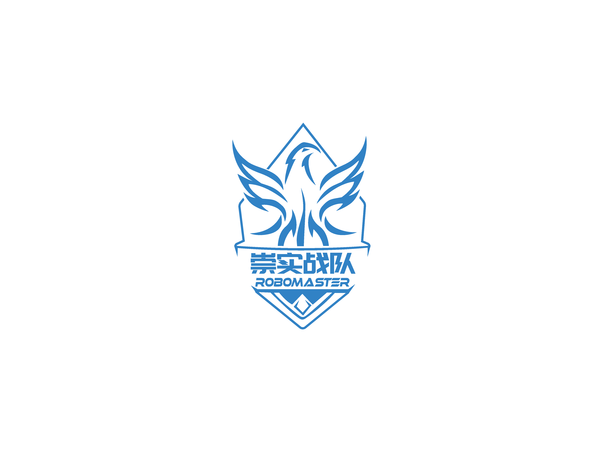

<h1 align = "center">武汉科技大学崇实战队</h1>

RoboMaster AI Challenge 完整功能包开源

&emsp;&emsp;该功能包是2021年ICRA人工智能挑战赛武汉科技大学崇实战队，基于官方提供RoboMaster AI机器人（2020标准版），在官方功能包的基础上修改完成的参赛完整功能包。其中，视觉部分开发较为完整，单独放出供各参赛队参考交流。作为第一次线下参赛队伍，开发完整度不足，望各位大佬批评指正，欢迎交流！

