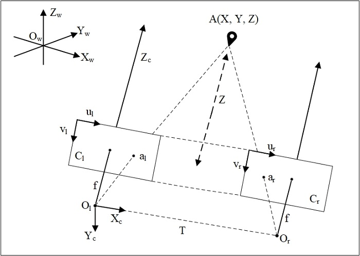
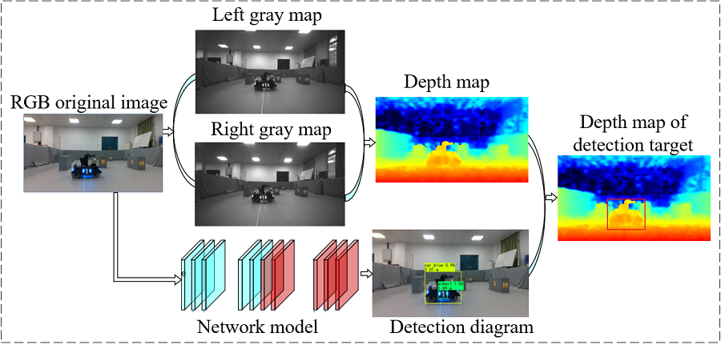
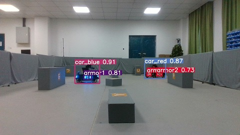
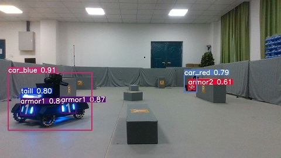
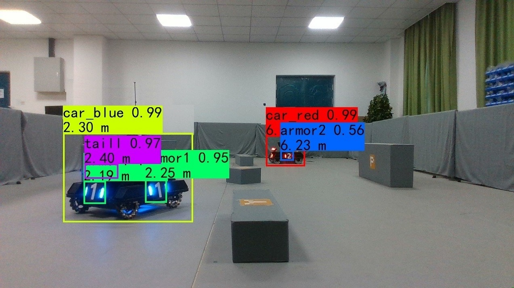
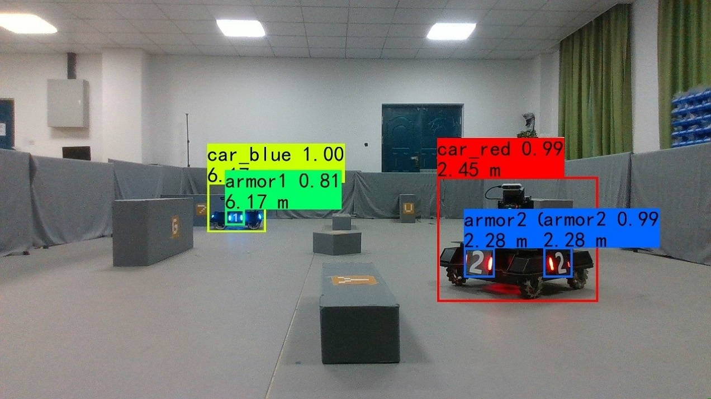
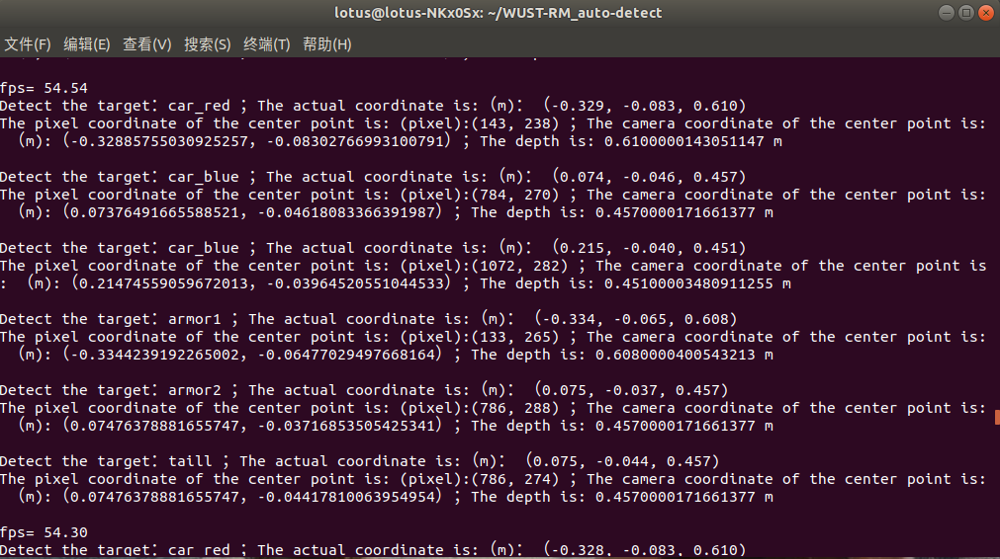

## 1. 软件功能介绍  
#### **检测识别算法框架：**    
&emsp;&emsp;深度学习在目标检测等视觉任务中具有较为广泛的应用，且具有较高的鲁棒性。虽然深度学习的计算代价较高，受限于比赛机器人所用的迷你电脑的性能，但是基于我们实验室已有的基础我们选择其进行目标检测。总共尝试了**yolov4, yolov4-tiny, "ultralytics yolov5", AlexeyAB发行的tensorRT加速版yolov4-tiny**框架，其中tensorRT加持的yolov4-tiny算法在我们的机载PC上识别速度能够高达近乎150帧，能够在三米内稳定识别装甲板和尾灯，7米之内稳定识别机器人，但是由于对装甲板的识别距离太近，限制了日后决策组发展，因此最后采取折中的方案，最终在哨岗视觉和机器人视觉处理上使用了来自ultralytics公司的"yolov5"框架，该框架在调节模型大小和优化器等参数后取得较好的效果，能够在6米内稳定识别装甲板和尾灯，识别机器人的准确度也很高。  
&emsp;&emsp;使用机载PC测试结果如下（以最后模型为准）：   

|                |ultralytics yolov5 |AlexeyAB版 yolov4-tiny                        |
|----------------|-------------------------------|-----------------------------|
|6米距离识别机器人  |  94%   |  80%  |
|6米距离识别装甲板  |  72%   |  NO   |
|稳定识别时的FPS(size不同)  |30-85   |   50-150|

#### **双目测距算法框架：**  

&emsp;&emsp;目标检测能较好的检测到目标，但这种检测只是在图像中得到目标的二维坐标，没有深度信息，所以不能进行一个瞄准轨迹的计算来精确击打，因此要利用深度相机进行深度测距得到目标的深度信息。以往采用的单目相机和PNP算法结合的深度估计方法误差较大，无法实现精准测距。因此我们尝试选择深度相机进行测距来获得敌方机器人的深度信息，利用Intel Realsense D435i相机提供的深度信息进行测距，该方法可以大大减小测距误差，从而实现精准射击，相机测距原理如下：
<div align="center">

</div>

<div align="center">图1 双目测距</div>

&emsp;&emsp;因此对深度图像数据和彩色图像数据做预处理，将深度图和彩色图对齐。像素对齐后，在彩色图上作检测，得到目标的检测框，然后去深度图找对应的框，取出该框中心点的深度值作为目标的距离信息。  
<div align="center">

</div>

<div align="center">图2 获取检测目标深度示意图</div>

## 2. 软件结果展示

&emsp;&emsp;为了实现对小车以及装甲板目标的高效、准确的检测和识别，通过自建多角度、多方位的目标数据集对YOLOv5网络的性能进行了检验。


<div align="center">
<center class="third">


</center>
</div>

<div align="center">图3 检测结果</div>
&emsp;&emsp;从上面的测试结果可以看出，网络可以很好的检测目标，分类准确，检测精度高，可以准确表达检测到的目标信息。

&emsp;&emsp;将目标检测和深度相机得到深度信息结合最后检测效果如下，返回检测目标的类别，置信度以及距离，如下图4所示。
<div align="center">
<center class="third">


</center>
</div>

<div align="center">图4 检测及测距结果</div>

&emsp;&emsp;为了测试深度相机测距的精度，我们进行了关于X、Y、Z方向的实验来验证测距的精度。相机官方资料给出Z方向的误差为2%，X、Y方向的误差小于Z方向。我们实验的情况为：60组Z方向的平均绝对误差为4%，30组X方向平均绝对误差为1.5%，30组Y方向平均绝对误差为1.1%，以上误差包括人工手动测量的误差。从X、Y、Z方向的不同距离抽取五组实验数据，计算三个方向预测值和真实值的绝对误差的平方和的平方根误差（SRSS），如下表1所示。总体误差在允许的范围内，但由于距离太近检测细节太明显误差会偏大，距离太远不可避免误差也会偏大。实际射击环境下的距离一般为二到四米，因此我们的测距精度满足实际需要。

<div align="center">表1 测距误差</div>

| S.No.          | 1      | 2     | 3      | 4     | 5      |
| -------------- | ------ | ----- | ------ | ----- | ------ |
| X_real         | -0.492 | 0.715 | -0.213 | 0.643 | -0.124 |
| X_predict      | -0.522 | 0.693 | -0.200 | 0.632 | -0.106 |
| Y_real         | -0.411 | 0.069 | -0.452 | 0.289 | -0.311 |
| Y_predict      | -0.391 | 0.069 | -0.450 | 0.297 | -0.301 |
| Z_real         | 1.200  | 2.800 | 4.000  | 5.400 | 6.200  |
| Z_predict      | 1.229  | 2.823 | 4.013  | 5.445 | 6.245  |
| error   (SRSS) | 0.046  | 0.032 | 0.020  | 0.047 | 0.054  |

&emsp;&emsp;通过将目标检测得到的二维（x, y)像素坐标和深度测距得到的深度距离z 进行结合，得到检测目标P的一个实际三维（X, Y, Z)坐标，测试结果如图5所示。
<div align="center">

</div>

<div align="center">图5 实际三维坐标信息</div>

## **3. 依赖工具，软、硬件环境**

#### **软件部分：**   

系统版本：Ubuntu18.04   

机载平台(jetson):   

pyrealsense2     

CUDA 10.2    

python3.6   

PyTorch1.6    

OpenCV3.4.x   

Jetpack 4.4   

PyYAML>=5.3     

scipy==1.4.1  

tqdm>=4.41.0    

numpy>=1.18.5    

matplotlib>=3.2.2     

torchvision>=0.7.0      

OpenCV-python>=4.1.2    

tensorRT: jetpack 4.4刷机时安装即可  

#### **硬件部分：**   
机载平台： Jetson AGX Xavier  

深度相机： Intel D435i深度相机，

RGB：1920x1080, 30FPS, 

深度图像：最高1280x720主动立体深度图，

FPS: 90 max  

# **4. 文件目录结构说明**   

```
├── my_roborts_camera
│   ├── src
│   │   ├── models
│   │   │   ├── common.py // 包含模型通用的模块
│   │   │    ├── export.py // 将训练好的.pt模型转换成onnx和TorchScript格式
│   │   │    ├── experimental.py // 包含实验模块还有加载训练好的模型函数
│   │   │   ├── yolo.py  //模型文件
│   │   ├── utils
│   │   │    ├── activations.py //激活函数文件
│   │   │    ├── datasets.py // 数据集文件
│   │   │     ├── googles_utils.py // google下载，下载谷歌驱动等功能
│   │   │    ├── torch_utils.py // 获取cuda可用时同步时间，选择gpu/cpu设备
|   │   │── weights // 检测模型存放位置
|   │   │── armor_classes.py // 读取摄像头视频流进行检测
│   ├── CMakeLists.txt // 编译配置文件，添加依赖项等
│   ├── package.xml // 描述文件
│   │── setup.py
│   │── CMakeLists.txt
```

```
├── roborts_detection
│   ├── armor_detection //视觉功能包 
│   │   ├── config 
│   │   ├── constraint_set //官方约束条件存放
│   │   ├── proto 
│   │   ├── yolo_bridge 
|   │   │   ├── config // 存放可执行文件的文件夹
|   |   │   │   ├── yolo_bridge.prototxt// 接受检测信息内容
|   │   │   ├── yolo_bridge.cpp //自建检测算法接口 
|   │   │   ├── yolo_bridge.h 
|   |   │   ├── CMakeLists.txt
|   |   ├── armor_detection_algorithms.h // 官方检测算法
|   |   ├── armor_detection_base.h  
|   |   ├── armor_detection_client.cpp //启动客户端
|   |   ├── armor_detection_node.cpp //启动节点
|   |   ├── armor_detection_node.h 
|   |   ├── gimbal_control.cpp // 云台控制接受检测目标位置信息
|   |   ├── gimbal_control.h 
|   |   ├── CMakeLists.txt
|   ├── cmake_module // 链接库
|   ├── out
|   ├── util
│   │── package.xml // 描述文件
│   │── CMakeLists.txt // 编译配置文件，添加依赖项等
```

# **5. 软件使用说明** 

## 数据集  
&emsp;&emsp;由于拍摄的数据集前后相关性不大，因此未采用视频标注工具而使用了labelimg的标注软件。yolov4使用的是voc格式的标签，ultralytics yolov5使用的是yolo格式的标签。机器人搭载的模型训练用的数据集一共3000张左右，在双显卡台式电脑上300 epochs, batch_size 32, train_size和test_size为480时训练时间3个小时左右， 由于该数据集比较大，不好上传暂不开源。（实际结果可能会有偏差，非严格测试）    

## 模型  

模型大小仅仅14MB左右 

### 检测模型
链接：https://pan.baidu.com/s/1VnVAdWoz3Sbb8nzG8tG7bw 
		提取码：hz6h      

### yolov5s权重
链接：https://pan.baidu.com/s/153I2qqZd1yK-AeGzy-1Rgg 
		提取码：gviy

### Reference   
https://github.com/AlexeyAB/darknet   		

https://github.com/ultralytics/yolov5   		

https://developer.nvidia.com/embedded/jetpack   		

https://docs.opencv.org/master/d9/df8/tutorial_root.html      

https://github.com/IntelRealSense/librealsense/blob/master/doc/distribution_linux.md

https://dev.intelrealsense.com/docs/compiling-librealsense-for-linux-ubuntu-guide

